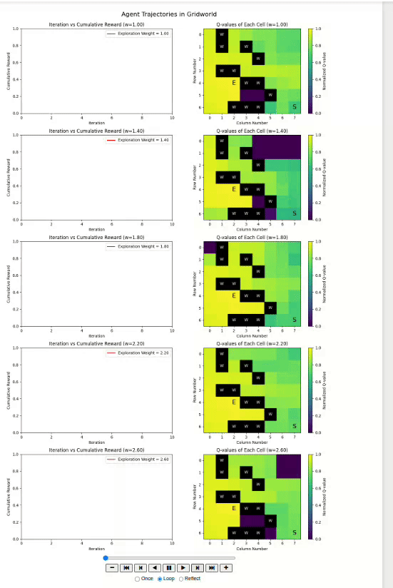

# Building-AI-Browser-Agents

## 📚 Project Overview

This repository contains **intelligent browser agents** that generate structured AI learning paths using **OpenAI's GPT** and real-time **web scraping** from [DeepLearning.AI](https://www.deeplearning.ai/courses). Based on user input, the system extracts, structures, and classifies courses into beginner, intermediate, and advanced levels. The project consists of three main components:

---

### 🔹 `simple_agent.ipynb` 
An interactive **Gradio-based web app** where users type a topic and receive a clean Markdown roadmap of courses, grouped by level. Ideal for quick and simple use.

---

### 🔹 `autonomous_agent.ipynb` 
A detailed **notebook interface** that walks through the logic step by step—web scraping, GPT-based filtering, and optional visualization. Best for research, debugging, or customization.

---

### 🔹 `MCTS and AgentQ.ipynb`
An **experimental agent** using **Monte Carlo Tree Search (MCTS)** and action planning logic. Designed to explore autonomous decision-making in course discovery and sequencing (work in progress).



---

## 📦 Versions

- 🧩 `simple_agent.ipynb`: Gradio-powered interactive app for real-time course recommendations.
- 📒 `autonomous_agent.ipynb`: A step-by-step notebook implementing logic with chain-of-thought reasoning.
- 🔁 `MCTS and AgentQ.ipynb`: (Experimental) Integrates Monte Carlo Tree Search and decision-based agents for autonomous planning (WIP).

---

## 🚀 Features

✅ Enter any AI-related topic (e.g., "RAG", "LangChain", "NLP")  
✅ Uses live data from DeepLearning.AI  
✅ GPT filters and structures raw course text  
✅ Automatically classifies courses: Beginner / Intermediate / Advanced  
✅ Clean Markdown outputs  
✅ Visualized roadmaps or Gradio UI

---

## 📁 Project Structure

```bash
├── simple_agent.ipynb           # 🧩 Gradio app + web scraper + GPT integration
├── autonomous_agent.ipynb       # 📒 Visual logic and experimentation
├── MCTS and AgentQ.ipynb        # 🔁 Planning agent framework (MCTS logic)
├── README.md                    # 📘 This file
```
---

### 🖥️ Display  

- **Simple Agent**: Returns Markdown-formatted course roadmap in a **Gradio web interface**  
- **Autonomous Agent**: Displays structured results in notebook cells and/or visualized using the `visualizeCourses()` function (if enabled)
- **MCTS Agent (Experimental)**: Integrates decision-making via search-based policies to extend automation.


## 🌟 Future Roadmap

- [ ] Add PDF export of generated course roadmap  
- [ ] Integrate additional course providers (Coursera, Udemy, edX)  
- [ ] Extend MCTS Agent to autonomous decision loops  
- [ ] Add roadmap feedback loop with user scoring  

